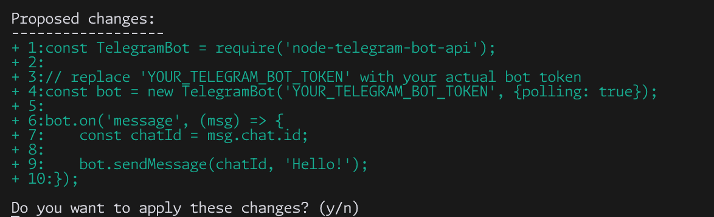

# Coders AI Assistant

Coders is an AI-powered command-line tool that helps you create, modify and improve your code.

## Features
- Create complete files, patch, find and fix bugs, and much more
- Flexible model selection: choose between default models or specify your own
- Quickly iterate on code and run within the terminal
- Diff view output: view changes in the terminal before accepting
- AST generation: automatically generates an Abstract Syntax Tree for better code understanding





## Options

- `-f, --file <FILE>`: Specify the file to process (required unless using --reset)
- `-m, --model`: Enable interactive model selection
- `-c, --claude`: Use Claude 3.7 Sonnet model
- `-g, --gemini`: Use Gemini 2.0 Flash model
- `-u, --custom-model <MODEL>`: Use a custom model by providing its name
- `-r, --reset`: Reset API key (will prompt for a new one on next run)
- `-v, --verbose`: Enable verbose output
- `-n, --no-ast`: Disable AST generation (AST is enabled by default)
- `-h, --help`: Display help information and all available options
- `-V, --version`: Print version information

## Default Models
The application uses OpenRouter as the AI provider with two default models:
- `anthropic/claude-3.7-sonnet:beta`: Claude 3.7 Sonnet (default)
- `google/gemini-2.0-flash-001`: Gemini 2.0 Flash

You can also specify any other model available on OpenRouter using the `-u/--custom-model` option.

## AST Generation
By default, the tool generates an Abstract Syntax Tree (AST) for your code to provide better context to the AI model. This helps the AI understand the structure of your code more effectively, resulting in more accurate modifications.

If you want to disable AST generation for any reason, use the `-n/--no-ast` flag.

### Example AST
For a simple JavaScript function:
```javascript
function add(a, b) {
  return a + b;
}
```

The generated AST might look like:

## First-time Setup

On the first run, you'll be prompted to enter your OpenRouter API key. This key will be saved for future use. If you need to reset your API key, use the `--reset` flag.

## Workflow

1. Run the command with your desired file.
2. Enter a prompt describing the changes you want to make to the code.
3. The AI will process your request and suggest changes.
4. Review the proposed changes (displayed in a diff-like format).
5. Choose to apply or discard the changes.

## Examples

Process a JavaScript file:
`coders -f main.js`


Choose a model before processing a Python file:
`coders -f -m script.py `


Choose 'openrouter' models
`coders -o -f script.py`

## Note

Make sure you have a valid API key. The tool will prompt you to enter it if it's not already saved.