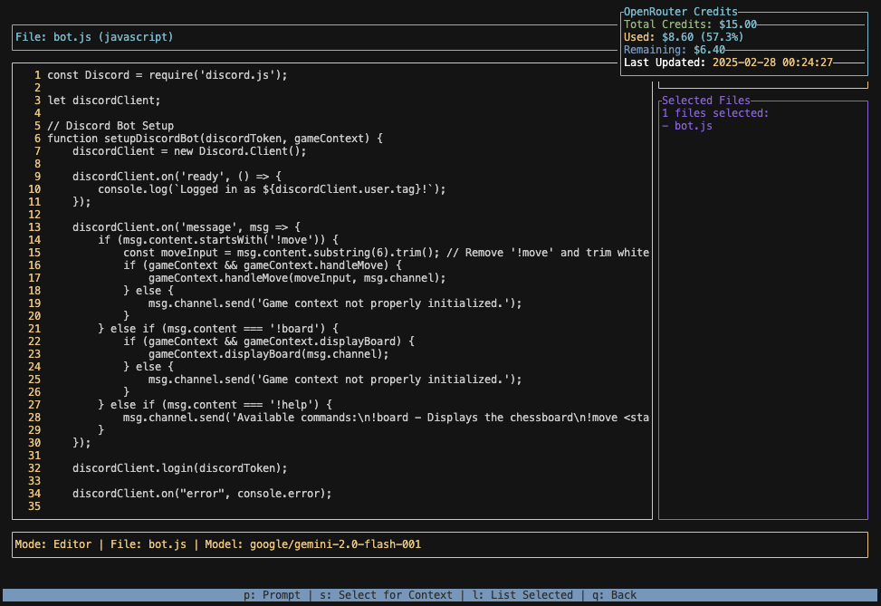

# Coders AI Assistant

Coders is an AI-powered terminal user interface (TUI) tool that helps you create edit code with any LLM on [OpenRouter](https://openrouter.ai/models).

## Features

- **Interactive TUI Interface**: Fully navigable terminal interface with keyboard shortcuts
- **Model Selection**: Choose between Claude, Gemini, or any OpenRouter model
- **Cost Tracking**: Monitor your OpenRouter **credit usage** directly in the app
- **File Browser**: Easily navigate and select files to modify
- **Multi-File Context**: Select multiple files to provide better context for AI prompts
- **Side-by-Side Diff View**: Compare original and modified code before accepting changes
- **Explanation Panel**: View AI explanations for each code change
- **AST Generation**: Automatically generates an Abstract Syntax Tree for better code understanding

## Getting Started

1. Launch the application with `cargo run`
2. On first run, you'll be prompted to enter your OpenRouter API key
3. Navigate the file browser to select a file to modify
4. Press the appropriate key to perform actions (as shown in the command bar)

## Navigation and Controls

The application has several modes, each with its own set of controls:

### Global Controls
- `h`: Access help screen from most modes

### Welcome Screen
- `Enter`: Continue to configuration or file browser
- `q`: Quit the application

### Configuration Screen
- `↑/↓`: Navigate between available models
- `Enter`: Select model and proceed
- `Ctrl+A`: Set API key

### File Browser
- `↑/↓`: Navigate between files
- `Enter`: Open selected file
- `m`: Switch to multi-file selection mode
- `c`: View credits information
- `q`: Quit the application
- `s`: Select File

### Multi-File Selection
- `↑/↓`: Navigate between files
- `Space`: Toggle selection of current file
- `Enter`: Confirm selection and proceed to prompt
- `Esc`: Return to file browser

### Editor View
- `↑/↓`: Scroll through file content
- `p`: Enter prompt mode to modify the file
- `q`: Return to file browser

### Prompt Input
- Type your request for code modifications
- `Enter`: Submit prompt
- `Esc`: Cancel and return to previous screen

### Results View
- `Tab`: Switch between original and modified code panels
- `e`: Toggle explanation panel
- `y`: Accept changes and apply them
- `n`: Reject changes and return to editor
- `q`: Return to file browser without applying changes
- `←/→`: Navigate between files when viewing multi-file diffs
- `↑/↓`: Scroll Files

### Credits Screen
- `q`: Return to previous screen

## Commands and Workflow

1. **Select a File**: Navigate the file browser and press `Enter` to open a file
2. **Provide Context (Optional)**: Press `m` to enter multi-file selection, choose additional files with `Space`, then confirm with `Enter`
3. **Modify Code**: With a file open, press `p` to enter a prompt describing the changes you want
4. **Review Changes**: In the diff view, examine the proposed changes and explanation
5. **Apply Changes**: Press `y` to accept changes or `n` to reject them
6. **Continue Iterating**: Make additional changes or select different files

## Cost Monitoring

Press `c` in the file browser to view your OpenRouter credits information:
- Total credits available
- Total usage so far
- Last updated time

## Model Selection

By default, the application uses Claude 3.7 Sonnet. To select a different model:
1. Start the application
2. In the configuration screen, use `↑/↓` to select a model
3. Select "custom" to enter any OpenRouter model ID

## API Key Management

Your OpenRouter API key is securely stored in your system's configuration directory:
- To change your API key, press `Ctrl+A` in the configuration screen
- Enter your new API key and press `Enter`

## Note

Make sure you have a valid OpenRouter API key. The application will prompt you to enter it if it's not already saved.